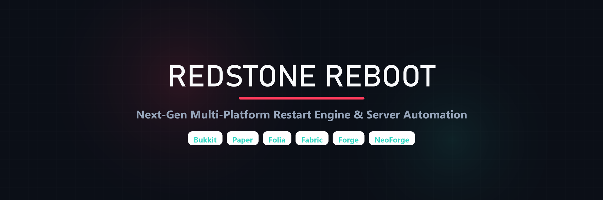

<div align="center">



# RedstoneReboot

**A restart engine for Minecraft servers across multiple platforms**

**Bukkit** · **Paper** · **Purpur** · **Folia** · **Fabric** · **Forge** · **NeoForge**

</div>

---

## Overview

RedstoneReboot manages automated server restarts, health monitoring, and backend process handoff for Minecraft servers.

Works on single Paper instances, Folia networks, and Fabric, Forge, or NeoForge servers running standalone or behind Pterodactyl.

### Features

| Feature | Description |
|---------|-------------|
| **Scheduling** | Set multiple restart times per day with timezone support and day-of-week filters |
| **Health Checks** | Tracks TPS and memory usage with consecutive checks to prevent false restarts |
| **Emergency Restarts** | Trigger immediate restarts if TPS drops or memory usage exceeds safety limits |
| **Notifications** | Countdown warnings via chat messages, titles, action bars, and sounds |
| **Backend Integration** | Delegates process restart to Pterodactyl API, systemd, Docker, or local scripts |
| **Hot Reload** | Update configuration live using `/reboot reload` without restarting the server |
| **PlaceholderAPI** | 8 placeholders for scoreboards, tab lists, and MOTD plugins (Bukkit/Folia) |
| **bStats Telemetry** | Anonymous usage statistics via [bStats](https://bstats.org/plugin/bukkit/RedstoneReboot/30751) |

---

## Quick Start

### Plugins (Bukkit / Paper / Folia)

1. Download the JAR from [Releases](https://github.com/DemonZ-Development/RedstoneReboot/releases/latest).
2. Place it in your `plugins/` directory.
3. Start the server to generate default configuration files.
4. Configure `plugins/RedstoneReboot/config.yml` and `plugins/RedstoneReboot/restart-backends.properties`.
5. Run `/reboot reload` to apply settings.

### Mods (Fabric / Forge / NeoForge)

1. Download the matching mod JAR (Fabric requires Fabric API).
2. Place it in your `mods/` directory.
3. Start the server to generate `config/redstonereboot/`.
4. Configure `config/redstonereboot/redstonereboot.properties` and `config/redstonereboot/restart-backends.properties`.
5. Run `/reboot reload` to apply settings.

---

## Supported Platforms

| Platform | Type | Minecraft Versions | Java |
|----------|------|--------------------|------|
| Bukkit / Spigot / Paper / Purpur | Plugin | MC 1.9 to 26.2+ | 8+ (legacy), 17+ (modern), 25 (26.x+) |
| Folia | Plugin | MC 1.20.1+ to 26.2+ | 17+, 25 (26.x+) |
| Fabric | Mod | MC 1.20.1+ to 26.2+ | 17+ (Fabric API required) |
| Forge | Mod | MC 1.20.4+ to 26.2+ | 17+ |
| NeoForge | Mod | MC 1.21.1+ to 26.2+ | 21+ |

---

## Commands

| Command | Permission | Description |
|---------|------------|-------------|
| `/reboot` | `redstonereboot.use` | Show plugin status and help |
| `/reboot status` | `redstonereboot.status` | View restart schedule and countdown |
| `/reboot info` | `redstonereboot.status` | Show server health diagnostics |
| `/reboot now [delay]` | `redstonereboot.restart.now` | Trigger a restart with optional countdown |
| `/reboot schedule <seconds>` | `redstonereboot.restart.schedule` | Schedule a future restart |
| `/reboot cancel` | `redstonereboot.restart.cancel` | Cancel a pending restart |
| `/reboot doctor` | `redstonereboot.doctor` | Run backend and environment diagnostics |
| `/reboot reload` | `redstonereboot.config.reload` | Hot-reload all configuration files |

---

## PlaceholderAPI Integration

RedstoneReboot integrates with [PlaceholderAPI](https://www.spigotmc.org/resources/placeholderapi.6245/) on Bukkit-family servers.

| Placeholder | Output |
|-------------|--------|
| `%redstonereboot_next_restart%` | `2026-04-15 06:00:00 Europe/London` |
| `%redstonereboot_time_until%` | `2h 30m` |
| `%redstonereboot_status%` | `Normal operation` or `Restart in progress` |
| `%redstonereboot_reason%` | `Scheduled Restart` or `None` |
| `%redstonereboot_tps%` | `19.8` |
| `%redstonereboot_memory%` | `62.4%` |
| `%redstonereboot_version%` | `1.5.0` |
| `%redstonereboot_timezone%` | `Europe/London` |

> **MOTD Compatible** — v1.3.3+ includes null-safety fixes for server-list MOTD plugins.

---

## Backend System

RedstoneReboot separates the **"when to restart"** from the **"how to restart"** through its backend handoff system. Configure `restart-backends.properties` to choose:

| Backend | Use Case |
|---------|----------|
| `DEPEND_ON_HOST` | Default — graceful shutdown, relies on external host environment (Pterodactyl, systemd, Docker, panel, script) |
| `LOCALSCRIPT` | Auto-generated wrapper script handles restart loop |
| `SYSTEMD` | Linux servers managed by systemd services |
| `DOCKER` | Docker containers with restart policies |
| `PTERODACTYL` | Pterodactyl panel API sends restart signals |

**Hot-reload**: Edit the backend config and run `/reboot reload` — no full server restart required.

---

## Documentation

- [**Wiki**](https://github.com/DemonZ-Development/RedstoneReboot/wiki) — Installation, configuration, backends, and troubleshooting
- [**Developer API**](https://github.com/DemonZ-Development/RedstoneReboot/blob/main/docs/api/README.md) — Bukkit API for plugin developers
- [**bStats**](https://bstats.org/plugin/bukkit/RedstoneReboot/30751) — Server usage statistics
- [**Discord**](https://discord.gg/GYsTt96ypf) — Support and community
- [**Instagram**](https://instagram.com/demonzdevelopment) — Updates and announcements

---

## Building from Source

```bash
git clone https://github.com/DemonZ-Development/RedstoneReboot.git
cd RedstoneReboot
./gradlew build
```

Requires **Java 21+** for building (NeoForge toolchain requirement).

Output JARs are located in `<module>/build/libs/`.

---

## Contributing

See [CONTRIBUTING.md](CONTRIBUTING.md) for development setup, coding standards, and PR guidelines.

---

## License

This project is licensed under the terms in the [LICENSE](LICENSE) file.

---

<div align="center">

Made by [**DemonZ Development**](https://demonzdevelopment.online)

</div>
